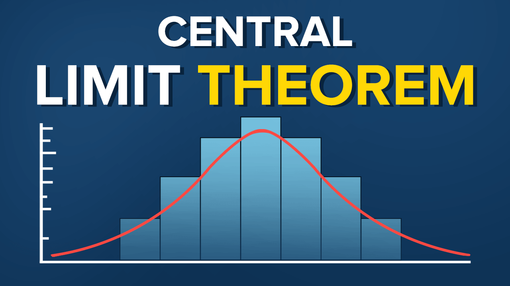

# Teorema-Central-do-Limite

Esse teorema é um importante resultado da estatística e a demonstração de muitos outros teoremas estatísticos dependem dele.
Em teoria das probabilidades, esse teorema afirma que quando o tamanho da amostra aumenta, a distribuição amostral da sua média aproxima-se cada vez mais de uma distribuição normal. Este resultado é fundamental na teoria da inferência estatística.

A aproximação para a normal melhora à medida que o tamanho amostral cresce e é notável porque permite-nos conduzir alguns procedimentos de inferência sem qualquer conhecimento da distribuição da população.

Iremos verificar nesse projeto, com algumas bibliotecas do python, gráficos mostrando como se comporta a distribuição com o aumento das amostras.

  

